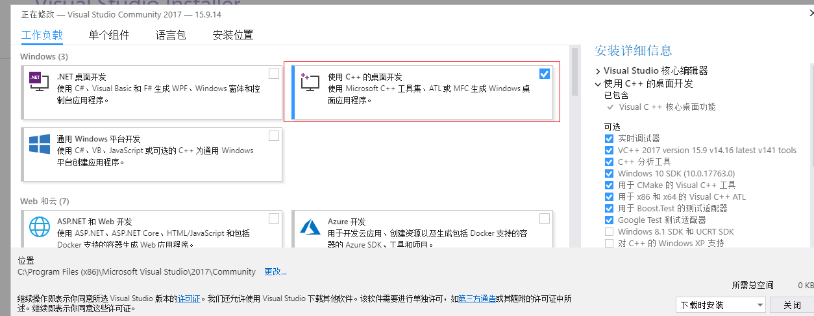

[TOC]

## 注意

**精力有限 项目变更为收费维护 有相关需求请进群私聊群主**

点击链接加入群聊【鬼手PC逆向3群】：https://jq.qq.com/?_wv=1027&k=wXH7AilL

如果觉得本项目对你有帮助 可以打赏一下作者 毕竟开源不易

## 更新说明

### 显示二维码闪退程序

解决方案：安装VS2017 勾选使用C++的桌面开发。问题即可解决

### 2019-7-26

1. 添加艾特群成员功能——好友列表->右键->查看群成员->右键->艾特群成员
2. 添加删除群成员功能——好友列表->右键->查看群成员->右键->删除群成员
3. 针对编译不过的问题 剥离解密数据库功能 请使用VS2017进行编译 
4. 如果编译不过 请将平台工具集和SDK版本修改为机器上的最新版本
5. 需要解密数据库功能请使用带解密数据库功能的成品

### 2019-7-29

1. 修复bug
2. 新增微信重要call的特征码 有参数注释和可用于OD搜索的十六进制特征码

### 2019-8-3

1. 优化自动聊天功能

### 2019-9-5

1. 新增功能：打开本程序自动启动微信 无需先启动微信再打开本程序
2. 聊天记录本地备份
3. 将成品编译方式修改为静态编译 无需安装VS环境

### 2019-9-18

1. 新增打开浏览器功能
2. 新增微信收款语音到账提示
3. 新增对邀请和移除群聊消息的解析(群成员邀请统计功能雏形)
4. 新增保存联系人到文本*(菜单->设置->保存联系人)
5. 修复图片解密失败bug

## 实现功能

## 项目介绍

编译环境为VS2017 只支持微信2.6.8.52版本。附上2.6.8.52微信版本的安装包

链接：https://pan.baidu.com/s/1kZTBDPHNSSbyC1tVP-Lj8g
提取码：d9oj

项目分为两个端，WeChatRobot和WeChatHelper。WeChatRobot作为客户端负责和服务端进行通信，将服务端传回的数据显示到界面。WeChatHelper作为服务端，注入到微信进程，进行取数据和HOOK的相关操作，并且将取回的数据发回给客户端。

客户端和服务端之间采用WM_COPYDATA的方式进行进程通讯，互相传输数据

## 效果演示

下面演示部分效果

### 初始化

将WeChatRobot.exe和WeChatHelper.dll放在同一个目录下，先打开微信，再打开exe

### 截取二维码

点击显示二维码 微信会自动跳转并截取二维码显示到客户端，再次点击可以刷新二维码

### 检测微信登陆状态&显示所有联系人

这里由于WM_COPYDATA通信状态下是阻塞的原因 所以联系人多的话可能会有些卡顿

### 发送文本 图片 和文件消息 

### 添加&删除好友

### 接收并显示所有类型消息

### 无限多开

### 解密数据库

### 自动聊天

### 自动收款

### 自动提取微信表情

微信的表情加密存放在下面的目录

``C:\Users\GuiShou\Documents\WeChat Files\crt873217126\FileStorage\CustomEmotion``

这个功能会将所有的未加密的表情存放到Temp目录下的WeChatExpressions文件夹里

还有很多效果，就不一一录制演示Gif了

## 技术细节

PCXX逆向：使用HOOK拦截二维码：https://blog.csdn.net/qq_38474570/article/details/92798577

PCXX逆向：发送与接收消息的分析与代码实现：https://blog.csdn.net/qq_38474570/article/details/93339861

PC微信逆向：两种姿势教你解密数据库文件：https://blog.csdn.net/qq_38474570/article/details/96606530

## 声明

**本项目仅供技术研究，请勿用于任何商业用途，请勿用于非法用途，如有任何人凭此做何非法事情，均于作者无关，特此声明。**