## 注意

1. 由于作者精力有限  本项目不再维护更新
2. 作者仍处于学习阶段 不接受任何需求定制 不接受任何问题咨询 更不要找我要工具。勿扰！！！
3. 另外我会将微信HOOK的所有学习笔记整理后上传CSDN
4. 请关注我的博客 以便第一时间看到分享干货：https://blog.csdn.net/qq_38474570

## 更新说明

### 2019-7-26

1. 添加艾特群成员功能——好友列表->右键->查看群成员->右键->艾特群成员
2. 添加删除群成员功能——好友列表->右键->查看群成员->右键->删除群成员
3. 针对编译不过的问题 剥离解密数据库功能 请使用VS2017进行编译 
4. 如果编译不过 请将平台工具集和SDK版本修改为机器上的最新版本
5. 需要解密数据库功能请使用带解密数据库功能的成品

### 2019-7-29

1. 修复bug
2. 新增微信重要call的特征码 有参数注释和可用于OD搜索的十六进制特征码

### 2019-8-3

1. 优化自动聊天功能

## 前言

最近一直都在研究微信逆向相关的东西，奈何目前所有相关的的接口和成品都在收费，所以就打算自己写一个，然后开源。

## 实现功能

## 项目介绍

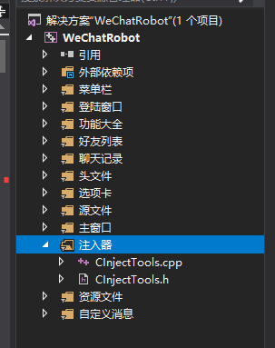

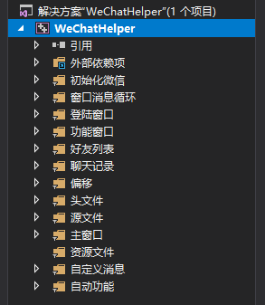

项目分为两个端，WeChatRobot和WeChatHelper。WeChatRobot作为客户端负责和服务端进行通信，将服务端传回的数据显示到界面。WeChatHelper作为服务端，注入到微信进程，进行取数据和HOOK的相关操作，并且将取回的数据发回给客户端。

客户端和服务端之间采用WM_COPYDATA的方式进行进程通讯，互相传输数据

## 效果演示

下面演示部分效果

### 初始化

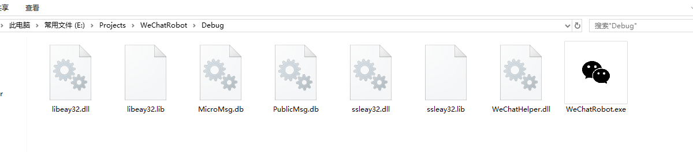

将WeChatRobot.exe和WeChatHelper.dll放在同一个目录下，先打开微信，再打开exe

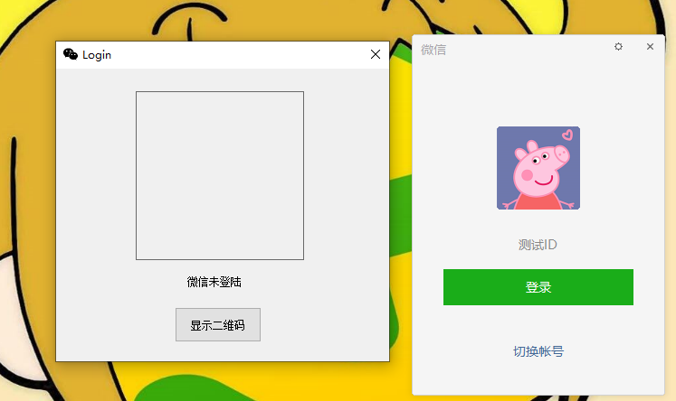

### 截取二维码

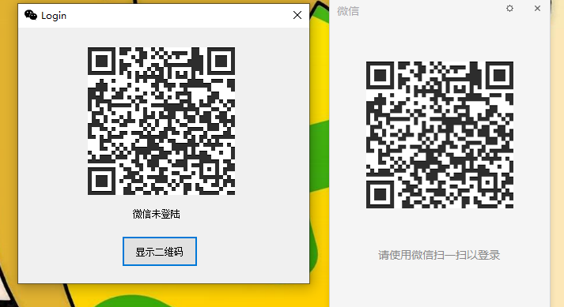

点击显示二维码 微信会自动跳转并截取二维码显示到客户端，再次点击可以刷新二维码

### 检测微信登陆状态&显示所有联系人

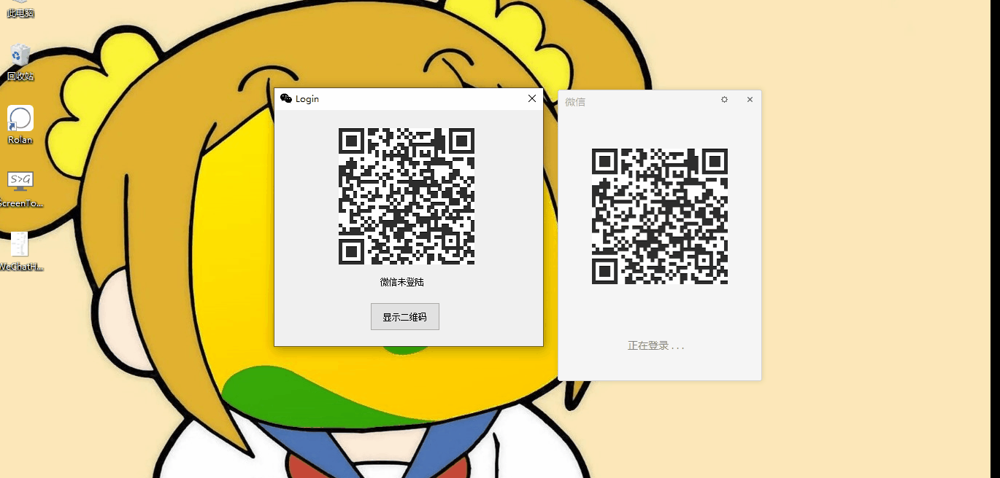

这里由于WM_COPYDATA通信状态下是阻塞的原因 所以联系人多的话可能会有些卡顿

### 发送文本 图片 和文件消息 

### 添加&删除好友

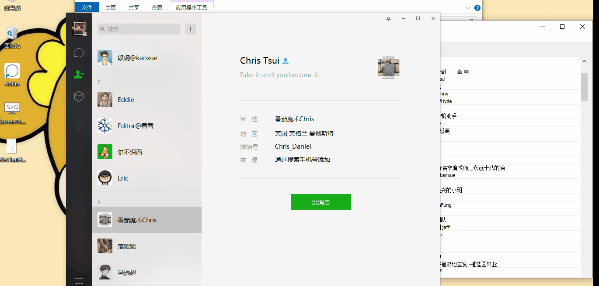

### 接收并显示所有类型消息

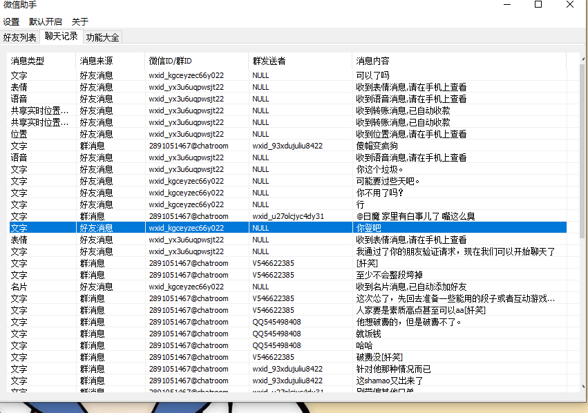

### 无限多开

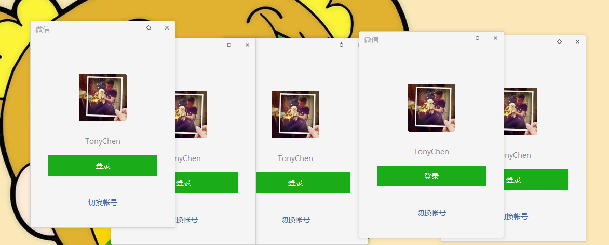

### 解密数据库

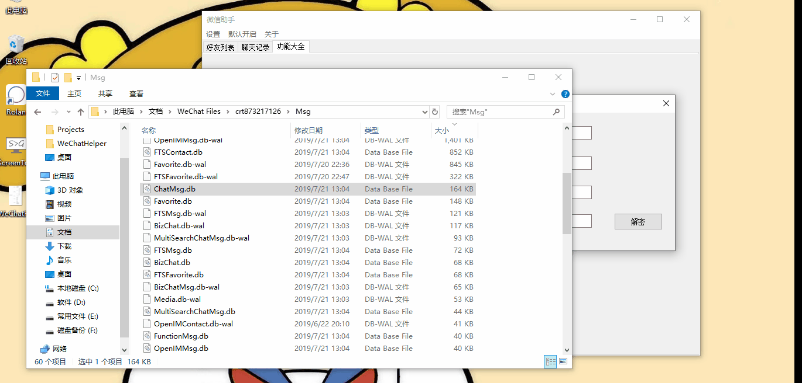

### 自动聊天

### 自动收款

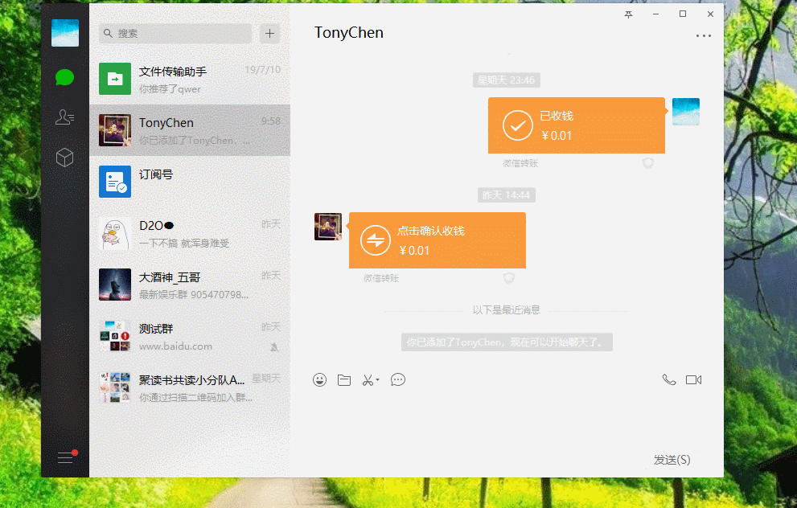

### 自动提取微信表情

微信的表情加密存放在下面的目录

``C:\Users\GuiShou\Documents\WeChat Files\crt873217126\FileStorage\CustomEmotion``

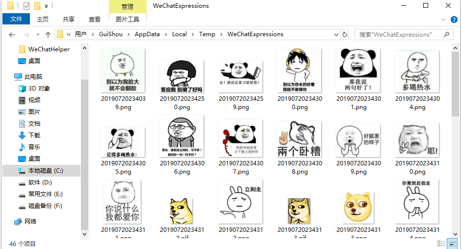

这个功能会将所有的未加密的表情存放到Temp目录下的WeChatExpressions文件夹里

还有很多效果，就不一一录制演示Gif了

## 成品和编译环境

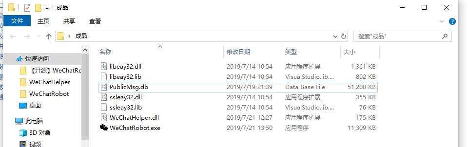

需要同时包含这几个文件才能运行，没有静态编译 可能需要VS环境。 目前只支持微信2.6.8.52版本。项目使用VS2017编译

## 技术细节

PCXX逆向：使用CE+OD查找个人数据：https://blog.csdn.net/qq_38474570/article/details/92571302

PCXX逆向：使用HOOK拦截二维码：https://blog.csdn.net/qq_38474570/article/details/92798577

PCXX逆向：发送与接收消息的分析与代码实现：https://blog.csdn.net/qq_38474570/article/details/93339861

PCXX逆向：使用HOOK获取好友列表和群列表：https://blog.csdn.net/qq_38474570/article/details/95889507

PC微信逆向：两种姿势教你解密数据库文件：https://blog.csdn.net/qq_38474570/article/details/96606530

## 声明

**本项目仅供技术研究，请勿用于任何商业用途，请勿用于非法用途，如有任何人凭此做何非法事情，均于作者无关，特此声明。**

## 项目地址

https://github.com/TonyChen56/WeChatRobot

开源不易，求个star
