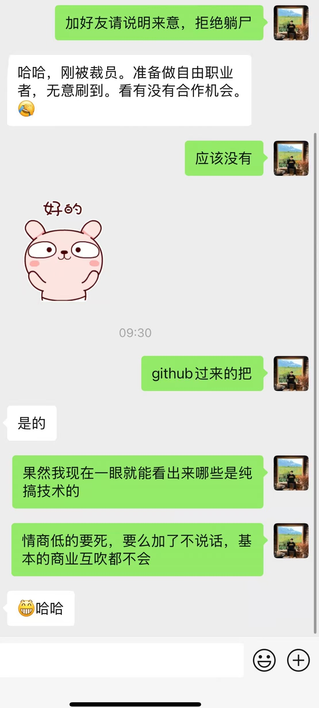
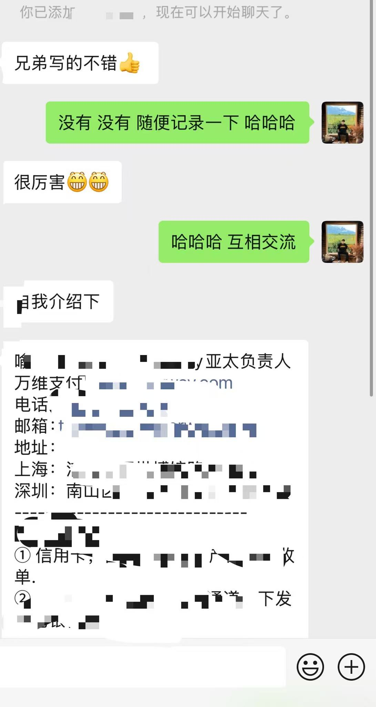

# WeChatRobot

> ⚠️ **本项目已停止维护，仅供学习参考**

📖 **完整项目文档请查看：[README_DETAILS.md](README_DETAILS.md)**

---

## 个人动态

微信相关的项目已经不在维护

最近**全职在做海外SaaS产品**，目前已经实现**月入千刀**，正在向**月入万刀**的目标前进！

**如果你也对此有兴趣，欢迎关注我的社媒**

**如果你也在做同样的事情，欢迎在推特私信和我交流**

## 推特 @guishou_56

### 公众号 Niko的出海记录

## 即刻 Niko_

---

## 鬼手社交小课堂

技术大哥们，加我之前请务必学习一下我的什么叫有效社交和无效社交

### 无效社交

上来直接躺尸，不懂商业互吹，不懂提供价值=无效社交；”看看有没有合作机会“，中译中，“看看有没有白嫖的机会”

从github加过来的，我没见过一个会主动夸人的；加之前想清楚能给我提供什么价值，提供不了请不要加好友，我还得删，挺累的

我本来不想说的这么直接，但是没办法，搞技术的情商实在太低了，搞的我烦不胜烦，不直接不行！

## 有效社交

有效社交=上来肯定对方+商业互吹+自我介绍+提供价值

